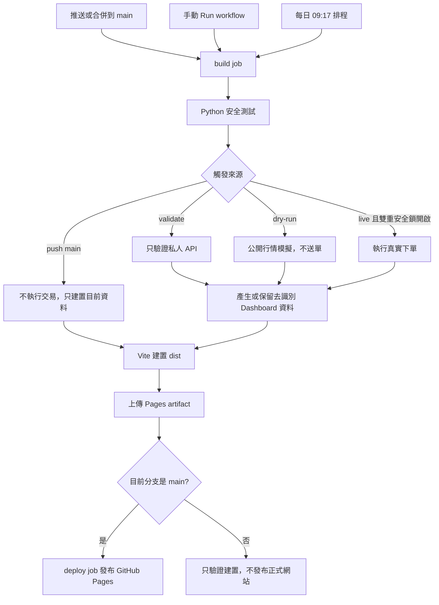

# 一塊日常：每日 USDT 成交與發票 Dashboard

這是一個以安全為預設的 GitHub Actions 自動化專案。它每天檢查 BitoPro 與 MAX 的官方門檻，符合規則時才允許下單，並把去識別化結果發布到 GitHub Pages。

> 重要：Dashboard 只納入具有官方私人下單 API、可由程式安全執行的交易所。沒有官方下單 API 的平台不會執行，也不會顯示。

## 2026-08 可行性

| 交易所 | 1 USDT | 官方 API | 發票現實 |
| --- | --- | --- | --- |
| BitoPro | 可用限價單 | 有 | 發票依每日手續費彙總；1 USDT 手續費通常未滿 1 元，可能是零元發票 |
| MAX | 不可，最低 8 USDT 且須達 NT$250 | 有 | 依每日實收手續費彙總，四捨五入滿 1 元才開立 |

交易所可能隨時調整費率、限額與 API。BitoPro 與 MAX 的門檻會在每次執行時重新從官方公開 API 讀取。MaiCoin、HOYA BIT、XREX、ZONE Wallet、TWEX、Chainss／Atrix、KryptoGO 等未提供一般會員官方私人下單 API 的平台均排除，不使用帳密、瀏覽器模擬登入或未公開端點。

## 安全設計

- 預設 `dry-run`，新部署不會下真實訂單。
- `validate` 模式只呼叫帳戶讀取 API，可在不下單的情況下先驗證 Key、Secret 與簽章。
- 真實下單需同時設定 `LIVE_TRADING=true` 與固定確認鎖。
- 每家交易所每天至多一筆正式成交；重跑 Actions 不會重複購買。
- BitoPro 使用限價吃單並限制滑價；未成交餘額會送出取消。
- API Key 只存 GitHub Secrets，請只授予「讀取＋現貨交易」，**不要授予提領權限**。
- Pages 只發布金額、狀態與原因，不發布 Email、API Key、完整訂單 ID 或完整發票號碼。
- 任一交易所失敗不會阻止其他交易所完成檢查。

## 本機執行

需求：Python 3.12、Node.js 22。

```bash
npm ci
python -m bot.runner --dry-run
npm run bot:verify
npm run dev
```

測試與正式建置：

```bash
npm test
```

## 目前版本的交易限制

部署前請先理解目前程式實際會做的事情：

- 只處理 `USDT/TWD`。
- 目前只會**買入** USDT，尚未實作每日買賣輪替。
- 下單目標使用 `ORDER_USDT`，是固定 USDT 數量，不是固定 TWD 金額。
- 同一個 `ORDER_USDT` 會套用到所有啟用的交易所。
- `ORDER_USDT=1` 時 BitoPro 可模擬或下單，MAX 因低於官方最低 8 USDT／NT$250 而自動略過。
- 成交只代表預估會產生手續費；交易 API 不會回傳真正的電子發票號碼。

因此，新部署建議先使用 `ORDER_USDT=1`、`MAX_ENABLED=false` 驗證 BitoPro。要測試 MAX 時，先停用 BitoPro，再把 `ORDER_USDT` 調到 MAX 當下官方最低量以上。不同交易所固定 TWD 金額與買賣輪替要等下一版實作後才能安全啟用。

## GitHub Actions 與 Pages 完整部署

目前 repository：<https://github.com/ChiJiun/usdt-invoice-pulse>

正式 Dashboard：<https://chijiun.github.io/usdt-invoice-pulse/>

目前 repository 已啟用 GitHub Pages，發布來源是 `GitHub Actions`，HTTPS 已開啟。工作流程檔案是 [`.github/workflows/dashboard.yml`](.github/workflows/dashboard.yml)。PR 分支上的新版前端不會直接覆蓋正式網站，必須先合併到 `main`。

GitHub Free 要免費使用 Pages，repository 應保持 public。Pages 與 public repository 的 Actions log 都可能被任何人查看；API 憑證只能放在 GitHub Secrets，不可寫入 README、Issue、程式碼、`public/`、`data/` 或一般 Actions Variables。

### 部署資料流



### Workflow 的三種觸發方式

| 觸發來源 | 何時執行 | 交易行為 | 是否更新資料 | 是否部署 Pages |
| --- | --- | --- | --- | --- |
| push 到 `main` | PR 合併或直接推送 | 不呼叫 runner，不下單 | 使用 repository 內現有資料 | 是 |
| 手動 `workflow_dispatch` | Actions 頁面按 **Run workflow** | 依 `validate`／`dry-run`／`live` | `dry-run` 與成功的 `live` 會更新 | 只有 Branch 選 `main` 才會部署 |
| 每日 `schedule` | 每日 `01:17 UTC`，台北時間 `09:17` | `LIVE_TRADING=true` 才 live，否則 dry-run | 是 | 是，排程只使用預設分支 |

手動模式的差異：

| mode | 會讀取私人 API | 會送出訂單 | 適合用途 |
| --- | --- | --- | --- |
| `validate` | 是，只讀帳戶 | 否 | 驗證 Key、Secret、Email、簽章及帳戶讀取權限 |
| `dry-run` | 否 | 否 | 第一次部署、每日安全模擬、確認最低門檻與 Dashboard |
| `live` | 是 | 可能；必須通過所有安全鎖 | 手動首單與正式交易 |

### 第一步：把 workflow 合併到 main

1. 開啟 repository 的 **Pull requests**。
2. 進入待合併 PR，確認 Files changed 與本機測試結果。
3. 將 Draft PR 標示為 **Ready for review**。
4. 點擊 **Merge pull request**，目標分支必須是 `main`。
5. 合併後到 **Code → `.github/workflows/dashboard.yml`**，確認 workflow 已存在於 `main`。

只有把分支推到 GitHub 不會更新正式網站。GitHub 的 **Run workflow** 按鈕也要求含有 `workflow_dispatch` 的 workflow 已存在於預設分支，因此第一次部署要先合併。

### 第二步：確認 GitHub Actions 權限

1. 進入 **Settings → Actions → General**。
2. 在 **Actions permissions** 確認允許執行本 repository 使用的 GitHub Actions。
3. 在 **Workflow permissions** 保持 repository 政策允許 workflow 取得寫入權限。
4. 本專案已在 YAML 明確限制並要求：
   - `contents: write`：只用來 commit／push 去識別化的 Dashboard 與每日防重複狀態。
   - `pages: write`：發布 Pages artifact。
   - `id-token: write`：GitHub Pages deployment 驗證。
5. 若組織政策禁止寫入，`Save sanitized dashboard data` 會在 `git push` 失敗；需由 repository 或 organization 管理員調整政策。

不需要開啟 **Allow GitHub Actions to create and approve pull requests**，這個 workflow 不會自動建立或核准 PR。

### 第三步：設定 GitHub Pages

1. 進入 **Settings → Pages**。
2. 找到 **Build and deployment**。
3. **Source** 選擇 **GitHub Actions**；不要選 `Deploy from a branch`。
4. 不需要建立 `gh-pages` branch，也不要把 `dist/` commit 進 repository。
5. 第一次成功後會自動建立 `github-pages` environment。
6. 部署完成後，Settings → Pages 會出現 **Visit site**：
   `https://你的帳號.github.io/你的-repository/`

本專案的 `build` job 會依序執行 `configure-pages`、建置 Vite、把 `dist/` 上傳成 Pages artifact；`deploy` job 只在 `main` 使用該 artifact 發布網站。

### 第四步：新增 Actions Variables

進入 **Settings → Secrets and variables → Actions → Variables → New repository variable**，逐筆建立：

| 名稱 | 建議初始值 | 是否敏感 | 說明 |
| --- | --- | --- | --- |
| `ORDER_USDT` | `1` | 否 | 每個啟用平台要求買入的 USDT 數量 |
| `LIVE_TRADING` | `false` | 否 | 真實交易總開關；第一次部署必須保持 `false` |
| `BITOPRO_ENABLED` | `true` | 否 | 載入 BitoPro adapter |
| `MAX_ENABLED` | `true` | 否 | 顯示並檢查 MAX；1 USDT 低於門檻時會安全略過 |

Variable 不是保密儲存，可能原樣顯示在 log。API Key、Secret、Email 與正式交易確認字串必須放在下一節的 **Secrets**。

### 第五步：第一次 dry-run 與 Pages 發布

1. 確認 `LIVE_TRADING=false`。
2. 進入 **Actions**。
3. 左側選擇 **Daily purchase and dashboard**。
4. 點擊右側 **Run workflow**。
5. Branch 選 `main`。
6. `mode` 選 `dry-run`。
7. 點擊綠色 **Run workflow**。
8. 重新整理頁面，開啟最新一筆 run。
9. 確認 `build` job 為綠色勾勾；展開步驟時應看到：
   - `Test purchase safeguards`
   - `Run selected automation mode`
   - `Save sanitized dashboard data`
   - `Build dashboard`
   - `Upload Pages artifact`
10. 確認 `deploy` job 也為綠色勾勾，並點擊 job 上方的 deployment URL。
11. 打開 Dashboard，確認顯示 `安全模擬`、只有 BitoPro／MAX，且沒有真實訂單編號。

`dry-run` 只讀取公開行情與最低下單限制，不需要交易所 API Key，也不會送出訂單。GitHub Pages 更新可能需要數分鐘；可到 **Settings → Pages** 或 workflow 的 `deploy` job 查看最新部署。

也可以使用 GitHub CLI 手動執行與等待結果：

```bash
gh workflow run dashboard.yml --ref main -f mode=dry-run
gh run list --workflow dashboard.yml --limit 5
gh run watch --exit-status
```

### 如何判斷部署成功

- Actions 最新 run 顯示 `completed / success`。
- `build` 與 `deploy` 兩個 job 都是綠色。
- `deploy` job 的 **Deploy GitHub Pages** 步驟成功。
- **Settings → Pages** 顯示網站網址與最近一次 deployment。
- Dashboard 頂端的更新時間與 `public/data/dashboard.json` 相符。
- 網址是 `https://<帳號>.github.io/<repository>/`，不是 repository 的 Code 頁面。

### Action 或 Pages 失敗時

| 失敗位置／現象 | 常見原因 | 處理方式 |
| --- | --- | --- |
| 看不到 **Run workflow** | workflow 尚未在預設分支，或 Actions 被停用 | 先合併到 `main`，再到 Settings → Actions 啟用 |
| `Test purchase safeguards` | Python 測試失敗 | 展開 log，先修復測試；不要啟用 live |
| `Run selected automation mode` | API 憑證、餘額、門檻或安全鎖失敗 | 依 log 的交易所與錯誤碼處理；不要把 Secret 貼到 Issue |
| `Save sanitized dashboard data` | `GITHUB_TOKEN` 沒有 contents write、branch protection 阻擋 bot push | 檢查 Actions／branch protection；必要時讓資料更新改走 PR |
| `Build dashboard` | npm install、TypeScript 或 Vite 建置失敗 | 展開該步驟，修復後按 **Re-run failed jobs** |
| `Upload Pages artifact` | `dist/` 未產生或 artifact 問題 | 確認 Build dashboard 成功，重新執行 workflow |
| `deploy` 顯示 skipped | 手動 run 的 Branch 不是 `main` | 改選 `main` 再執行 |
| `Deploy GitHub Pages` 失敗 | Pages Source／權限錯誤，或 GitHub Pages 佇列超過 20 分鐘 | 先檢查 `pages: write`、`id-token: write`；若 log 持續顯示 `deployment_queued`，等待後重新執行 |
| 網站 404 | 尚未完成首次 deployment、網址錯誤或部署仍在傳播 | 從 Settings → Pages 的 **Visit site** 開啟，等待數分鐘再重整 |
| 網站仍是舊版 | PR 尚未合併、deploy 未成功或瀏覽器快取 | 確認 `main` commit 與 deployment，再強制重新整理 |

官方參考：[設定 GitHub Pages 發布來源](https://docs.github.com/pages/getting-started-with-github-pages/configuring-a-publishing-source-for-your-github-pages-site)、[以自訂 GitHub Actions 發布 Pages](https://docs.github.com/pages/getting-started-with-github-pages/using-custom-workflows-with-github-pages)、[手動執行 workflow](https://docs.github.com/actions/how-tos/manage-workflow-runs/manually-run-a-workflow)、[GitHub Actions Variables](https://docs.github.com/actions/concepts/workflows-and-actions/variables)、[GitHub Actions Secrets](https://docs.github.com/actions/how-tos/write-workflows/choose-what-workflows-do/use-secrets)。

## 建立交易所 API Key

### BitoPro

1. 登入 BitoPro 網頁版，進入 **API Management**。
2. 建立例如 `github-daily-usdt` 的 API Key。
3. 只授予讀取帳戶與現貨交易權限。
4. **不要授予提領、出金或建立提領地址權限。**
5. 保存 Email、API Key 與只顯示一次的 API Secret。

官方文件：<https://github.com/bitoex/bitopro-official-api-docs>

### MAX

1. 登入 MAX 網頁版並進入 API Key 管理頁。
2. 建立只具有讀取帳戶與現貨交易權限的 Key。
3. **不要開啟提領權限。**
4. 保存 Access Key 與 Secret Key。

官方文件：<https://campaign.maicoin.com/api-document>

GitHub-hosted runner 使用動態共用 IP，不能提供固定 IP 白名單。如果帳戶政策要求固定來源 IP，請不要使用此免費部署方式，應改用具有固定出站 IP 的 self-hosted runner。

## 新增 GitHub Secrets

進入 **Settings → Secrets and variables → Actions → Secrets → New repository secret**。只新增你準備啟用的平台：

| Secret | 用途 |
| --- | --- |
| `BITOPRO_EMAIL` | BitoPro 登入 Email；用於官方 API 簽章內容 |
| `BITOPRO_API_KEY` | BitoPro API Key |
| `BITOPRO_API_SECRET` | BitoPro API Secret |
| `MAX_API_KEY` | MAX Access Key |
| `MAX_API_SECRET` | MAX Secret Key |
| `CONFIRM_LIVE_TRADING` | 必須完全等於 `I_UNDERSTAND_THIS_PLACES_REAL_ORDERS` |

請直接在 GitHub 設定頁輸入。不要把 Secret 貼到對話、Actions log、Issue 或 commit。若曾經外洩，應立即在交易所撤銷並重建。

## 無下單驗證 API

驗證前保持 `LIVE_TRADING=false`。

1. 進入 **Actions → Daily purchase and dashboard → Run workflow**。
2. Branch 選 `main`，`mode` 選 `validate`。
3. BitoPro 成功時會顯示：`BitoPro：API 簽章與帳戶讀取權限正常`。
4. MAX 只有在 `ORDER_USDT` 同時符合最低 USDT 與 TWD 門檻時才會要求私人 API 憑證；低於門檻會顯示略過。
5. `validate` 只讀取帳戶資料，不會建立、取消或成交訂單。

若要單獨驗證 MAX：

1. 設定 `BITOPRO_ENABLED=false`、`MAX_ENABLED=true`。
2. 將 `ORDER_USDT` 設為 MAX 公開 API 當下最低量以上；目前通常至少為 `8`，仍以 workflow 讀到的即時門檻為準。
3. 執行 `validate`。
4. 驗證完成後，把 `LIVE_TRADING` 保持為 `false`，再決定正式數量。

## 首次真實下單

真實下單會使用交易所資金。先確認交易方向、數量、可用餘額與 API 權限；建議一次只啟用一家。

以 BitoPro 1 USDT 首單為例：

1. 設定 `ORDER_USDT=1`、`BITOPRO_ENABLED=true`、`MAX_ENABLED=false`。
2. 確認 BitoPro TWD 可用餘額足以支付成交額、手續費及價格緩衝。
3. 確認 `CONFIRM_LIVE_TRADING` Secret 已正確設定。
4. 將 `LIVE_TRADING` 改成 `true`。
5. 進入 **Run workflow**，選擇 `live`，只執行一次。
6. 到 BitoPro 官方訂單紀錄核對成交數量，再查看 Dashboard 的去識別化結果。
7. 若結果與預期不同，立刻把 `LIVE_TRADING` 改回 `false`。

首次正式單成功後，schedule 才會在 `LIVE_TRADING=true` 時自動呼叫正式模式。若保持 `false`，每日排程只會 dry-run。

## 每日排程與停止方式

- 排程設定在 `.github/workflows/dashboard.yml`。
- 目前每天 `01:17 UTC` 執行，即台北時間 `09:17`。
- GitHub 排程可能延遲或偶爾漏跑，不能保證每日準點成交。
- 公開 repository 長期沒有活動時，GitHub 可能停用 scheduled workflow，需到 Actions 重新啟用。

緊急停止順序：

1. 將 Actions variable `LIVE_TRADING` 改成 `false`。
2. 必要時到交易所撤銷 API Key。
3. 到 **Actions** 取消仍在執行的 workflow。
4. 不需要刪除 repository 或 Dashboard。

## 部署後檢查清單

- [ ] Pages Source 是 GitHub Actions。
- [ ] 正式程式已合併到 `main`。
- [ ] `LIVE_TRADING=false` 完成第一次 dry-run。
- [ ] Dashboard 只顯示 BitoPro、MAX。
- [ ] API Key 沒有提領權限。
- [ ] `validate` 成功且沒有送出訂單。
- [ ] 首次 live 只啟用一家交易所。
- [ ] 已在交易所官方介面核對首筆訂單。
- [ ] 已知道如何關閉 `LIVE_TRADING` 與撤銷 API Key。

## 常見問題

| 現象 | 原因與處理 |
| --- | --- |
| MAX 顯示略過 | `ORDER_USDT` 低於 MAX 當下最低量或成交額；這是正常安全行為 |
| `LIVE_TRADING 尚未開啟` | workflow 選了 `live`，但 variable 仍是 `false` |
| `Unauthorized api key`／簽章失敗 | 檢查 Key、Secret、BitoPro Email、權限與 Key 是否已過期；不要把值貼到 log |
| 餘額不足 | 補足對應交易所 TWD 餘額，或保持 `LIVE_TRADING=false` |
| 今日已有正式成交 | 每日防重複機制生效，不會再次下單 |
| Pages 404 | 確認 PR 已合併至 `main`、Pages Source 正確、`deploy` job 成功 |
| 排程沒有執行 | 到 Actions 檢查 workflow 是否被停用；也可手動執行 `dry-run` |

## 發票狀態的限制

交易 API 不會回傳電子發票號碼。程式會依實際或估算手續費標記「預估零元／預估可開立」，但只有交易所通知、綁定載具或財政部平台能確認真正開立。

若要在 dashboard 顯示已確認發票，可把**遮罩後**資料加入 `data/confirmed-invoices.json`：

```json
[
  {
    "id": "2026-07-bitopro-01",
    "exchange": "BitoPro",
    "issued_date": "2026-07-12",
    "amount_twd": "1",
    "masked_number": "AB••••••12",
    "status": "issued"
  }
]
```

不要提交完整發票號碼、隨機碼、手機條碼或會員 Email。若需要全自動核對，建議下一階段串接個人載具的合法授權流程，並把完整資料留在私有儲存，不放 GitHub Pages。

## 免責

本專案是個人紀錄工具，不構成投資、稅務、法律或中獎建議。自動交易可能因價格波動、API 變更、餘額不足、系統延遲或交易所規則而失敗；啟用真實模式前請自行確認最新條款與風險。
