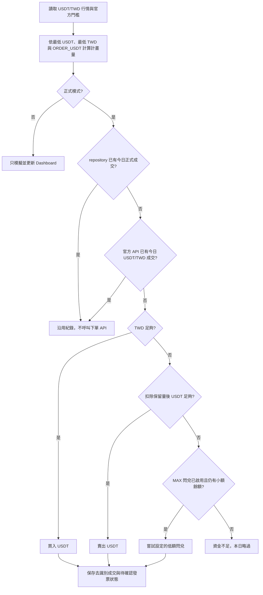

# 一塊日常：每日 USDT/TWD 成交與發票 Dashboard

使用 GitHub Actions 每日執行 BitoPro 與 MAX 的低額 `USDT/TWD` 交易，並把去識別化的成交與發票確認狀態發布到 GitHub Pages。

- Repository：<https://github.com/ChiJiun/usdt-invoice-pulse>
- Dashboard：<https://chijiun.github.io/usdt-invoice-pulse/>
- 預設安全狀態：`LIVE_TRADING=false`，只模擬、不會下真實訂單。

> 只納入具有官方私人下單 API、可以程式安全執行的平台。目前為 BitoPro 與 MAX；不使用帳密模擬登入、瀏覽器腳本或未公開下單端點。

## 支援範圍

| 交易所 | `ORDER_USDT=1` 時 | 資金不足時 | 發票狀態 |
| --- | --- | --- | --- |
| BitoPro | 最低約 1 USDT 限價現貨 | TWD 不足則改賣 USDT；兩者都不足就略過 | 成交後約兩天內通知，API 不含發票明細 |
| MAX | 最低 8 USDT，且成交額至少 NT$250 | TWD 不足則改賣 USDT；現貨兩邊都不足時可試低額閃兌 | 約 1–3 個工作天開立，API 不含發票明細 |

門檻會在每次交易執行時從官方公開 API 重新讀取；`ORDER_USDT` 是設定下限，不是固定 1 USDT，也不是上限。

## GitHub Actions 與 Pages 完整部署

照以下順序即可完成部署。GitHub Free 使用 Pages 時，repository 應保持 public。

### 1. 開啟 GitHub Pages

1. Repository → **Settings → Pages**。
2. **Build and deployment → Source** 選擇 **GitHub Actions**。
3. 不需要建立 `gh-pages` branch，也不要 commit `dist/`。

### 2. 建立 Actions Variables

前往 **Settings → Secrets and variables → Actions → Variables**：

| Variable | 建議初始值 | 用途 |
| --- | --- | --- |
| `ORDER_USDT` | `1` | 每家希望至少交易的 USDT；MAX 會自動提高到最低 8 USDT／NT$250 |
| `USDT_RESERVE` | `0` | 賣出安全緩衝；`0` 代表不保留，`20` 代表現貨與 MAX 閃兌都不動用最後 20 USDT |
| `MAX_CONVERT_ENABLED` | `true` | MAX 現貨資金不足時，是否允許嘗試官方閃兌 |
| `MAX_CONVERT_TWD_AMOUNT` | `10` | TWD → USDT 閃兌單次上限 |
| `MAX_CONVERT_USDT_AMOUNT` | `1` | USDT → TWD 閃兌單次上限；仍會扣除 `USDT_RESERVE` |
| `BITOPRO_ENABLED` | `true` | 是否執行 BitoPro |
| `MAX_ENABLED` | `true` | 是否執行 MAX |
| `LIVE_TRADING` | `false` | 真實交易總開關；完成 dry-run 與驗證前不要改成 `true` |

Variables 不是保密儲存，不能放 API Key、Secret、Email 或確認鎖。

### 3. 建立交易所 API Key 與 Actions Secrets

API Key 只授予「讀取帳戶＋現貨交易」，**不要授予提領、出金或新增提領地址權限**。

- BitoPro：登入網頁版 → API Management，保存 Email、API Key、API Secret。
- MAX：登入網頁版 → API Key 管理，保存 Access Key、Secret Key。

接著到 **Settings → Secrets and variables → Actions → Secrets** 建立：

| Secret | 用途 |
| --- | --- |
| `BITOPRO_EMAIL` | BitoPro API 簽章中的會員 Email |
| `BITOPRO_API_KEY` | BitoPro API Key |
| `BITOPRO_API_SECRET` | BitoPro API Secret |
| `MAX_API_KEY` | MAX Access Key |
| `MAX_API_SECRET` | MAX Secret Key |
| `CONFIRM_LIVE_TRADING` | 必須完全等於 `I_UNDERSTAND_THIS_PLACES_REAL_ORDERS` |

只需設定已啟用交易所的憑證。若 Key 曾出現在對話、log、Variable、Issue 或 commit，先到交易所撤銷並重建，再啟用 live。

GitHub-hosted runner 沒有固定出站 IP；如果交易所帳戶強制固定 IP 白名單，請改用具固定 IP 的 self-hosted runner。

### 4. 第一次 dry-run

1. 確認 `LIVE_TRADING=false`。
2. 前往 **Actions → Daily USDT trade and dashboard → Run workflow**。
3. Branch 選 `main`，mode 選 `dry-run`。
4. 等待 `build` 與 `deploy` 都出現綠色勾勾。
5. 打開 Dashboard，應看到「安全模擬」、BitoPro 約 1 USDT、MAX 至少 8 USDT，且沒有真實訂單。

`dry-run` 只讀公開行情與交易門檻，不讀私人餘額、不會送單，也不會把模擬結果算成真實成交。

### 5. 無下單驗證 API

再次按 **Run workflow**，mode 選 `validate`：

- BitoPro 只讀 `/accounts/balance`。
- MAX 只讀 `/api/v3/wallet/spot/accounts`。
- 成功代表 Key、Secret、Email、簽章與帳戶讀取權限正常。
- `validate` 不建立、取消或成交訂單。

### 6. 第一次真實下單

建議一次只測一家：

1. 先將另一家的 `*_ENABLED` 設為 `false`。
2. 核對 `ORDER_USDT`、`USDT_RESERVE` 與帳戶可用餘額。
3. 確認 API Key 沒有提領權限，且 `CONFIRM_LIVE_TRADING` 已正確設定。
4. 將 `LIVE_TRADING` 改成 `true`。
5. 手動執行 workflow，mode 選 `live`，只執行一次。
6. 到交易所官方訂單／成交紀錄核對，再檢查 Dashboard。
7. 若結果不符預期，立刻將 `LIVE_TRADING` 改回 `false` 並撤銷 API Key。

確認第一家正常後，再啟用第二家。MAX 第一次 live 建議先設 `MAX_CONVERT_ENABLED=false` 驗證現貨，確認後才開啟閃兌 fallback。

### 7. 每日排程

- 排程：每日 `01:17 UTC`，即台北時間 `09:17`。
- `LIVE_TRADING=true`：執行成交查重，必要時才下真實訂單。
- `LIVE_TRADING=false`：只執行 dry-run。
- GitHub 排程可能延遲或偶爾漏跑，不保證準點成交。
- public repository 長期無活動時，GitHub 可能停用 scheduled workflow，需到 Actions 重新啟用。

### 部署成功的判斷方式

- 最新 Actions run 顯示 `completed / success`。
- `Build, update data, and upload Pages artifact` 成功。
- `Deploy dashboard to GitHub Pages` 成功。
- <https://chijiun.github.io/usdt-invoice-pulse/> 可開啟，更新時間與 `public/data/dashboard.json` 相符。

直接 push 到 `main` 即會部署，不需要手動 merge。push 只執行 `python -m bot.runner --refresh`：不呼叫交易所 API、不會下單，只重建 repository 內的成交／發票公開資料與 Pages artifact。

## 交易與防重複邏輯

程式只處理 `USDT/TWD`，不會碰其他幣種或交易對。



防重複共有三層：

1. `data/state.json` 的當日正式成交。
2. Dashboard 已保存的當日 live 成交。
3. 官方成交歷史：BitoPro 查現貨 trades；MAX 查現貨 trades 與 converts。

因此當天若已手動完成一筆 USDT/TWD 成交，也會被視為今日已成交，不再新增訂單。

### 餘額與失敗反饋

| 情況 | 行為與 Dashboard 反饋 |
| --- | --- |
| TWD 足夠 | 買入計畫量 USDT，顯示買入、現貨、成交量與均價 |
| TWD 不足、USDT 足夠 | 賣出計畫量 USDT，並保留 `USDT_RESERVE` |
| MAX 現貨不足但仍有小額餘額 | 最多嘗試設定的 NT$10 或 1 USDT 閃兌；被拒絕時不自動加碼 |
| 兩種資產都不足 | 略過，不把單純零餘額當成程式錯誤 |
| 今日已有成交 | 沿用既有結果，不再次呼叫下單 API |
| 市場維護 | 略過並顯示市場狀態 |
| 憑證、網路、簽章或拒單錯誤 | 顯示去識別化失敗原因；另一家仍繼續執行 |

## 今日成交與昨日發票

Dashboard 的 `DAILY PULSE` 分開顯示：

- **今日成交**：由 repository 與官方成交 API 自動判斷；dry-run 會清楚標示「僅模擬，未成交」。
- **昨日發票**：由 `data/invoice-records.json` 的安全紀錄判斷。
- **發票明細**：有安全 `detail_url` 時可以點擊；否則顯示交易所官方查詢說明。

BitoPro 與 MAX 的交易 API 都不會回傳台灣電子發票號碼，因此不能只靠交易 API 自動確認開票。BitoPro 約兩天內通知，MAX 約 1–3 個工作天開立；「昨日尚未查到」不代表最終不會開立。

### Email 自動核對可行性

可以自動擷取兩家交易所寄來的發票信，但信箱授權方式必須依供應商實作；目前版本尚未連接信箱，也沒有任何 Email 密碼相關環境變數。

- Gmail：使用 Gmail API 的唯讀 OAuth 與 refresh token，不保存 Google 密碼。
- Outlook／Microsoft 365：使用 Microsoft Graph 的 `Mail.Read` OAuth，不使用已淘汰的基本帳密驗證。
- 其他信箱：需確認是否提供 OAuth IMAP；不應把主要信箱密碼放入 GitHub Secrets。

因為開票會延遲，未來的自動核對不應只搜尋「昨天收到的信」，而會每天回查最近 7 天仍待確認的成交，限制寄件者與主旨，再把解析出的開立日、金額、遮罩發票號碼與檢查時間寫入 `data/invoice-records.json`。原始信件、完整號碼、隨機碼、載具與 OAuth access token 都不會發布到 Pages；無法唯一對應成交日時標示 `manual_check`，不會猜測。

正式加入前需要先決定收信信箱是 Gmail、Outlook 或其他服務，才能採用正確的 OAuth 流程與最小權限。官方參考：[Gmail API](https://developers.google.com/workspace/gmail/api/guides)、[Gmail 伺服器端 OAuth](https://developers.google.com/workspace/gmail/api/auth/web-server)、[Microsoft Graph／Exchange 開發建議](https://learn.microsoft.com/en-us/Exchange/client-developer/exchange-server-development)。

### 更新發票紀錄

以成交日作為 `trade_date`，編輯 `data/invoice-records.json`：

```json
[
  {
    "id": "2026-08-05-max",
    "exchange": "max",
    "trade_date": "2026-08-05",
    "status": "confirmed",
    "checked_at": "2026-08-06T10:30:00+08:00",
    "issued_date": "2026-08-06",
    "amount_twd": "1",
    "masked_number": "AB••••••12",
    "detail_url": "https://www.einvoice.nat.gov.tw/APCONSUMER/BTC601W/",
    "note": "已由載具確認"
  }
]
```

| `status` | 意義 |
| --- | --- |
| `pending_confirmation` | 已成交，仍在合理等待期 |
| `confirmed` | 已從 Email、載具或財政部平台確認開立 |
| `not_found` | 已查詢但目前尚無資料，之後仍可更新 |
| `manual_check` | 資訊不足，需要人工再確認 |

推送紀錄後會自動更新 Pages：

```bash
git add data/invoice-records.json
git commit -m "chore: update invoice records"
git push origin main
```

公開 repository 不可保存完整發票號碼、隨機碼、手機條碼、Email、會員資料或查詢 token。完整號碼即使誤填也會在 Dashboard 輸出時遮罩；含帳密、query string 或 fragment 的 `detail_url` 會被拒絕發布。

官方查詢方式：[BitoPro 發票查詢與載具綁定](https://support.bitopro.com/hc/zh-tw/articles/360018704812)、[MAX 發票查詢與對領獎](https://support.maicoin.com/zh-TW/support/solutions/articles/32000026066)。

## Workflow 模式

| 觸發方式 | 行為 | 會下單嗎 | 會部署 Pages 嗎 |
| --- | --- | --- | --- |
| push `main` | `--refresh`，只重建公開資料 | 否 | 是 |
| 手動 `validate` | 只讀私人帳戶 API | 否 | 是 |
| 手動 `dry-run` | 公開行情模擬 | 否 | 是 |
| 手動 `live` | 查重後依餘額決定交易 | 可能；需通過雙重安全鎖 | 是 |
| 每日 schedule | `LIVE_TRADING=true` 才 live，否則 dry-run | 依設定 | 是 |

Workflow 檔案：`.github/workflows/dashboard.yml`。權限用途：

- `contents: write`：提交去識別化 Dashboard 與防重複狀態。
- `pages: write`、`id-token: write`：部署 GitHub Pages。

若 organization 或 branch protection 禁止 Actions 寫入，資料 commit 可能失敗，需要 repository 管理員調整政策。

## 緊急停止

1. 將 Actions Variable `LIVE_TRADING` 改成 `false`。
2. 到交易所撤銷 API Key。
3. 到 GitHub Actions 取消仍在執行的 workflow。

不需要刪除 repository 或 Dashboard。

## 本機驗證

需求：Python 3.12、Node.js 22。

`.env.example` 是設定名稱參考，Python 不會自動載入該檔；本機驗證私人 API 前，請先在目前 shell 設定需要的環境變數。GitHub 部署則使用前述 Variables 與 Secrets。

```bash
npm ci
python -m bot.runner --dry-run
npm run bot:verify
npm test
```

`npm test` 會執行 Python 防護測試、TypeScript 檢查與 Vite 正式建置。

## 常見問題

| 現象 | 原因與處理 |
| --- | --- |
| MAX 顯示 8 USDT | 正常；`ORDER_USDT=1` 是下限，MAX 會提高到官方最低量 |
| MAX 計畫量高於 8 USDT | NT$250 最低成交額換算後需要更多 USDT，或 `ORDER_USDT` 設得更高 |
| MAX 閃兌失敗 | 官方未公開最低量；程式不會自動加碼，可調整閃兌 Variables 或關閉 fallback |
| `LIVE_TRADING 尚未開啟` | workflow 選了 live，但 Variable 仍是 `false` |
| `Unauthorized api key`／簽章失敗 | 檢查 Secret、BitoPro Email、權限與 Key 是否過期；不要把值貼到 log |
| 餘額不足而略過 | TWD 不足，扣除保留量後的 USDT 也不足；MAX 可能同時沒有可用閃兌額 |
| `USDT_RESERVE` 要設多少 | 它不是交易所門檻，只是防止程式賣光 USDT；不需要保留量就維持 `0` |
| 今日已有正式成交 | 防重複機制生效，會沿用既有結果而不再下單 |
| deploy 顯示 skipped | 手動 workflow 選的 Branch 不是 `main` |
| Pages 404 或仍是舊版 | 確認 deploy job 成功，從 Settings → Pages 的 **Visit site** 開啟並等待快取更新 |
| 排程沒有執行 | 到 Actions 檢查 scheduled workflow 是否被 GitHub 停用 |

## 官方參考

- [BitoPro 官方 API](https://github.com/bitoex/bitopro-official-api-docs)
- [BitoPro 發票規則](https://support.bitopro.com/hc/zh-tw/articles/360001517911)
- [MAX API 文件](https://max-api.maicoin.com/doc/v3.html)
- [MAX 發票規則](https://support.maicoin.com/zh-TW/support/solutions/articles/32000021074)
- [GitHub Pages 自訂 Actions](https://docs.github.com/pages/getting-started-with-github-pages/using-custom-workflows-with-github-pages)
- [GitHub Actions Secrets](https://docs.github.com/actions/how-tos/write-workflows/choose-what-workflows-do/use-secrets)

## 免責

本專案是個人自動化與紀錄工具，不構成投資、稅務、法律或中獎建議。自動交易可能因價格波動、API 變更、餘額不足、排程延遲或交易所規則而失敗；啟用真實模式前請自行確認最新條款與風險。
