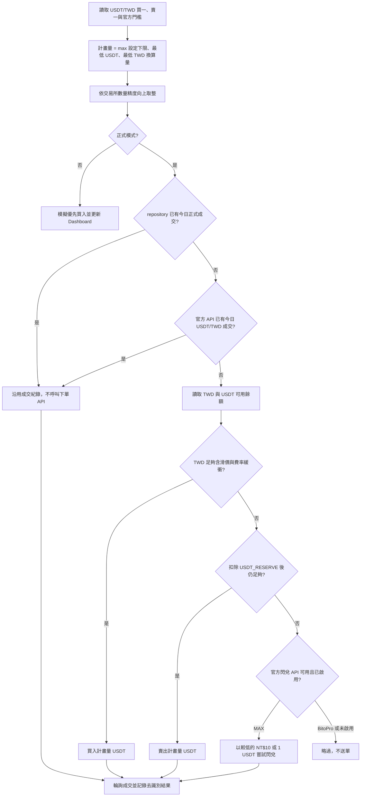
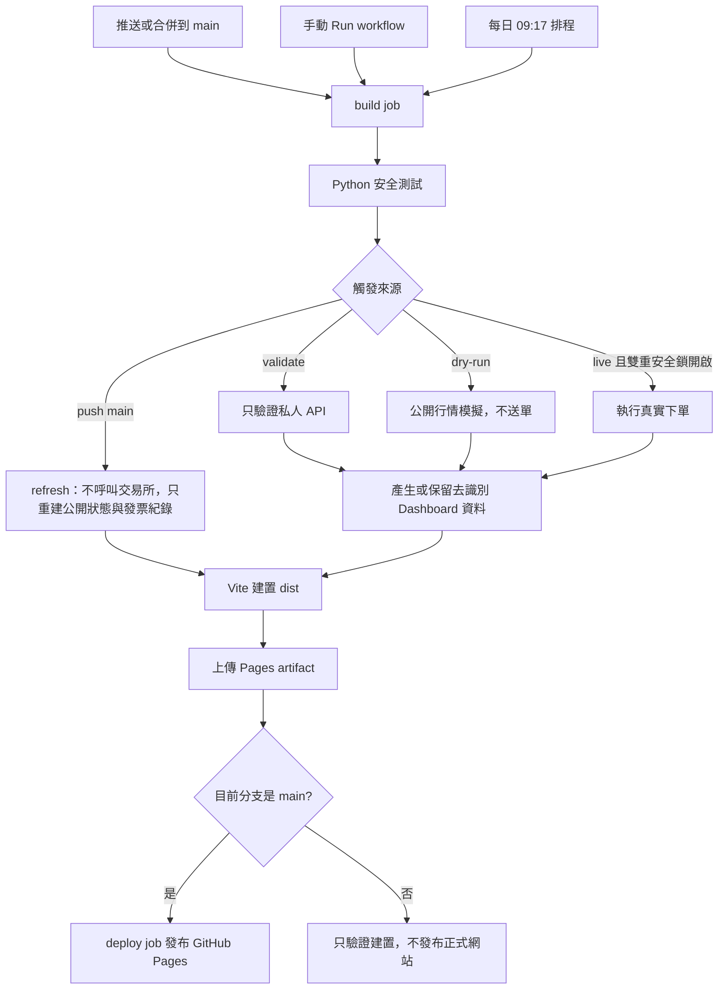

# 一塊日常：每日 USDT/TWD 雙向交易與發票 Dashboard

這是一個以安全為預設的 GitHub Actions 自動化專案。它每天先檢查 BitoPro 與 MAX 是否已有 USDT/TWD 成交，再依餘額嘗試最低額現貨；MAX 現貨資金不足時可再嘗試低額閃兌。GitHub Pages 會把「今日是否成交」與「昨日發票是否開出」並排顯示。

> 重要：Dashboard 只納入具有官方私人下單 API、可由程式安全執行的交易所。沒有官方下單 API 的平台不會執行，也不會顯示。

## 2026-08 可行性

| 交易所 | `ORDER_USDT=1` 時的計畫量 | 官方 API | 發票現實 |
| --- | --- | --- | --- |
| BitoPro | 1 USDT 限價單 | 有，支援 BUY／SELL、餘額與成交歷史；官方 API 沒有閃兌執行端點 | 成交後約兩天內寄送開立通知；交易 API 不含發票明細 |
| MAX | **8 USDT 市價單**；資金不足時預設再試 NT$10 或 1 USDT 閃兌 | 有，支援 buy／sell、現貨餘額、成交歷史與 TWD／USDT 閃兌 | 成交後約 1–3 個工作天開立；交易 API 不含發票明細 |

交易所可能隨時調整費率、限額與 API。BitoPro 與 MAX 的門檻會在每次執行時重新從官方公開 API 讀取。MaiCoin、HOYA BIT、XREX、ZONE Wallet、TWEX、Chainss／Atrix、KryptoGO 等未提供一般會員官方私人下單 API 的平台均排除，不使用帳密、瀏覽器模擬登入或未公開端點。

## 安全設計

- 預設 `dry-run`，新部署不會下真實訂單。
- `validate` 模式只呼叫帳戶讀取 API，可在不下單的情況下先驗證 Key、Secret 與簽章。
- 真實下單需同時設定 `LIVE_TRADING=true` 與固定確認鎖。
- 每家交易所每天至多一筆正式成交；先查 `data/state.json`／Dashboard，再查官方當日成交歷史，重跑或手動成交後都不會再下新單。
- BitoPro 使用限價吃單並限制滑價；未成交餘額會送出取消。
- MAX 閃兌是立即成交 API，只有在現貨資金不足、正式模式及雙重安全鎖都通過時才會呼叫。
- API Key 只存 GitHub Secrets，請只授予「讀取＋現貨交易」，**不要授予提領權限**。
- Pages 只發布金額、狀態與原因，不發布 Email、API Key、完整訂單 ID 或完整發票號碼。
- 發票明細連結只接受無帳密、無 query、無 fragment 的 HTTPS URL；含 token 的私人查詢網址會被丟棄。
- 任一交易所失敗不會阻止其他交易所完成檢查。

## 本機執行

需求：Python 3.12、Node.js 22。

```bash
npm ci
python -m bot.runner --dry-run
npm run bot:verify
npm run dev
```

測試與正式建置：

```bash
npm test
```

## 交易邏輯

程式只處理 `USDT/TWD`，不會碰其他幣種或交易對。`ORDER_USDT` 是「希望至少交易多少 USDT」，不是所有交易所都固定成交同一數量，也不是 1 USDT 上限。

每次執行會對每家交易所各自完成下列流程：



以預設 `ORDER_USDT=1` 為例：

- BitoPro 官方最低 1 USDT，計畫量為 1 USDT。
- MAX 官方最低 8 USDT 且成交額至少 NT$250；目前價格下通常計畫量為 **8 USDT**。
- 若 MAX 的 USDT/TWD 價格低到 `8 × 價格 < 250`，程式會依 0.01 USDT 精度再向上提高，不會送出低於 NT$250 的訂單。
- 若把 `ORDER_USDT` 設成 12，兩家計畫量都至少是 12 USDT。

方向不是每日買賣輪替，而是固定的餘額優先序：**TWD 足夠就買現貨；TWD 不足但 USDT 足夠就賣現貨；MAX 兩邊都達不到現貨門檻時，再嘗試低額閃兌。** `USDT_RESERVE` 可保留不想被自動賣掉的 USDT，預設為 0。

MAX 閃兌 fallback 的預設策略：

- 有 TWD 時，使用 `min(可用 TWD, MAX_CONVERT_TWD_AMOUNT)`，預設最多 NT$10，方向為 TWD → USDT。
- 沒有 TWD、但扣除保留量後仍有 USDT 時，使用 `min(可出售 USDT, MAX_CONVERT_USDT_AMOUNT)`，預設最多 1 USDT，方向為 USDT → TWD。
- 官方文件未公開閃兌最低量，所以程式只嘗試設定的低額，不會在失敗後自行加碼；可依實際成交或拒絕訊息再調整 Variables。
- 為避免 Actions 中斷或手動交易造成重複成交，BitoPro 會查 `GET /orders/trades/usdt_twd`；MAX 會查 `GET /api/v3/wallet/spot/trades` 與 `GET /api/v3/converts`。找到當日任一筆 USDT/TWD 成交就沿用並停止新增交易。

### 狀態與反饋

| 情況 | Dashboard 狀態 | 是否送單 | 反饋 |
| --- | --- | --- | --- |
| dry-run | `模擬完成` | 否 | 顯示各平台自動調整後的計畫量；因不讀私人餘額，以優先買入情境估算 |
| TWD 足夠 | `成交`／`部分成交`／`失敗` | 買單 | 顯示「買入」、實際成交量、均價與「成交待確認」 |
| TWD 不足、USDT 足夠 | `成交`／`部分成交`／`失敗` | 賣單 | 顯示「賣出」及相同成交摘要 |
| MAX 現貨資金不足但仍有小額 TWD／USDT | `成交` 或 `失敗` | 閃兌 | 最多嘗試設定的低額；成功標示「閃兌／成交待確認」，拒絕時不自動加碼 |
| BitoPro 現貨不足，或 MAX 完全沒有可用額 | `已略過` | 否 | 顯示資金不足，本日不交易；不把單純零餘額當程式錯誤 |
| 交易對維護或非 active | `已略過` | 否 | 顯示市場狀態 |
| 憑證、簽章、網路或交易所拒單 | `失敗` | 可能未送出或未成交 | 顯示去識別化錯誤；另一家交易所仍會繼續 |
| repository 或交易所查到今日已有正式成交 | `成交`／`部分成交` | 否 | 沿用既有結果，並清楚標示未再次呼叫下單 API |

程式不再依手續費金額推算發票。現貨或閃兌只要 API 回報成交，就標記「成交待確認」；真正的電子發票號碼與金額仍須以交易所通知、Email 或手機載具確認。

## 今日成交與昨日發票 Dashboard

Dashboard 的 `DAILY PULSE` 區塊對每家交易所顯示兩個獨立事實：

- **今日成交**：正式模式先讀 repository 已保存狀態；沒有紀錄時再查交易所官方私人成交 API。`dry-run` 只顯示「僅模擬，未成交」。
- **昨日發票**：由 `data/invoice-records.json` 的安全紀錄判斷。若昨日有正式成交但尚未補資料，顯示「成交待確認」；如果沒有正式成交紀錄，顯示「不適用」。
- **發票連結**：有安全 `detail_url` 時顯示「查看明細」；沒有時連到 BitoPro／MAX 官方查詢說明。官方交易 API 沒有電子發票明細端點，因此無法只靠交易 Key 自動確認發票號碼。

發票通常不是成交後立刻可查。BitoPro 官方說明為交易完成兩天內收到開立通知；MAX 官方說明為完成交易後 1–3 個工作天內開立。因此「昨日尚未查到」不等於最終不會開立，應在後續 workflow 或人工確認後更新狀態。

### 留下安全發票紀錄

編輯 `data/invoice-records.json`，以**成交日**作為 `trade_date`：

```json
[
  {
    "id": "2026-08-05-max",
    "exchange": "max",
    "trade_date": "2026-08-05",
    "status": "confirmed",
    "checked_at": "2026-08-06T10:30:00+08:00",
    "issued_date": "2026-08-06",
    "amount_twd": "1",
    "masked_number": "AB••••••12",
    "detail_url": "https://www.einvoice.nat.gov.tw/APCONSUMER/BTC601W/",
    "note": "已由載具確認"
  }
]
```

`status` 可使用：

| 值 | Dashboard 顯示 | 適用情況 |
| --- | --- | --- |
| `pending_confirmation` | 成交待確認 | 已成交，仍在合理開立等待期 |
| `confirmed` | 已確認 | 已從 Email、載具或財政部平台確認開立 |
| `not_found` | 尚未查到 | 已查詢但目前沒有資料；之後仍可改成 confirmed |
| `manual_check` | 待確認 | 資訊不足，需人工再查一次 |

完整發票號碼即使誤填也會在輸出時自動遮罩；但仍不要把發票隨機碼、手機條碼、Email、會員資料或任何查詢 token commit 到 public repository。`detail_url` 必須是沒有帳密、query string 與 fragment 的 HTTPS 網址，否則 runner 不會發布。舊的 `data/confirmed-invoices.json` 仍可讀取，但新紀錄請統一放到 `data/invoice-records.json`。

更新後直接推送 `main` 即可，不需要手動 merge：

```bash
git add data/invoice-records.json
git commit -m "chore: update invoice records"
git push origin main
```

push 觸發的 workflow 只執行 `python -m bot.runner --refresh`：它不讀交易所 API、不會下單，只把新發票紀錄重新整理進當次 Pages artifact 並發布。

官方查詢說明：[BitoPro 發票查詢與載具綁定](https://support.bitopro.com/hc/zh-tw/articles/360018704812)、[MAX 發票查詢與對領獎](https://support.maicoin.com/zh-TW/support/solutions/articles/32000026066)。

## GitHub Actions 與 Pages 完整部署

目前 repository：<https://github.com/ChiJiun/usdt-invoice-pulse>

正式 Dashboard：<https://chijiun.github.io/usdt-invoice-pulse/>

目前 repository 已啟用 GitHub Pages，發布來源是 `GitHub Actions`，HTTPS 已開啟。工作流程檔案是 [`.github/workflows/dashboard.yml`](.github/workflows/dashboard.yml)。只有 `main` 的建置會發布正式網站；可直接推送 `main`，或使用 PR 合併到 `main`。

GitHub Free 要免費使用 Pages，repository 應保持 public。Pages 與 public repository 的 Actions log 都可能被任何人查看；API 憑證只能放在 GitHub Secrets，不可寫入 README、Issue、程式碼、`public/`、`data/` 或一般 Actions Variables。

### 部署資料流



### Workflow 的三種觸發方式

| 觸發來源 | 何時執行 | 交易行為 | 是否更新資料 | 是否部署 Pages |
| --- | --- | --- | --- | --- |
| push 到 `main` | 直接推送程式或 `invoice-records.json` | `--refresh`，不呼叫交易所 API、不下單 | 立即把 repository 中的成交／發票紀錄重建進 Pages artifact | 是 |
| 手動 `workflow_dispatch` | Actions 頁面按 **Run workflow** | 依 `validate`／`dry-run`／`live` | `dry-run` 與成功的 `live` 會更新 | 只有 Branch 選 `main` 才會部署 |
| 每日 `schedule` | 每日 `01:17 UTC`，台北時間 `09:17` | `LIVE_TRADING=true` 才 live，否則 dry-run | 是 | 是，排程只使用預設分支 |

手動模式的差異：

| mode | 會讀取私人 API | 會送出訂單 | 適合用途 |
| --- | --- | --- | --- |
| `validate` | 是，只讀帳戶 | 否 | 驗證 Key、Secret、Email、簽章及帳戶讀取權限 |
| `dry-run` | 否 | 否 | 第一次部署、每日安全模擬、確認最低門檻與 Dashboard |
| `live` | 是 | 可能；必須通過所有安全鎖 | 手動首單與正式交易 |

### 第一步：確認 workflow 已在 main

1. 在本機執行 `npm test`。
2. 將已驗證的 commit 直接推送到 `main`，或把功能分支合併到 `main`。
3. 到 **Code → `.github/workflows/dashboard.yml`**，確認 workflow 已存在於 `main`。
4. 到 **Actions**，確認 `Daily USDT trade and dashboard` 已出現。

本 repository 目前採直接推送 `main`，不需要再手動 merge。單純推送非 `main` 分支只會驗證建置，不會更新正式 Pages。

### 第二步：確認 GitHub Actions 權限

1. 進入 **Settings → Actions → General**。
2. 在 **Actions permissions** 確認允許執行本 repository 使用的 GitHub Actions。
3. 在 **Workflow permissions** 保持 repository 政策允許 workflow 取得寫入權限。
4. 本專案已在 YAML 明確限制並要求：
   - `contents: write`：只用來 commit／push 去識別化的 Dashboard 與每日防重複狀態。
   - `pages: write`：發布 Pages artifact。
   - `id-token: write`：GitHub Pages deployment 驗證。
5. 若組織政策禁止寫入，`Save sanitized dashboard data` 會在 `git push` 失敗；需由 repository 或 organization 管理員調整政策。

不需要開啟 **Allow GitHub Actions to create and approve pull requests**，這個 workflow 不會自動建立或核准 PR。

### 第三步：設定 GitHub Pages

1. 進入 **Settings → Pages**。
2. 找到 **Build and deployment**。
3. **Source** 選擇 **GitHub Actions**；不要選 `Deploy from a branch`。
4. 不需要建立 `gh-pages` branch，也不要把 `dist/` commit 進 repository。
5. 第一次成功後會自動建立 `github-pages` environment。
6. 部署完成後，Settings → Pages 會出現 **Visit site**：
   `https://你的帳號.github.io/你的-repository/`

本專案的 `build` job 會依序執行 `configure-pages`、建置 Vite、把 `dist/` 上傳成 Pages artifact；`deploy` job 只在 `main` 使用該 artifact 發布網站。

### 第四步：新增 Actions Variables

進入 **Settings → Secrets and variables → Actions → Variables → New repository variable**，逐筆建立：

| 名稱 | 建議初始值 | 是否敏感 | 說明 |
| --- | --- | --- | --- |
| `ORDER_USDT` | `1` | 否 | 希望每家至少交易的 USDT；程式會依平台最低 USDT／TWD 門檻向上調整 |
| `USDT_RESERVE` | `0` | 否 | 賣出前必須保留的 USDT；例如設 `20` 就不會動用最後 20 USDT |
| `MAX_CONVERT_ENABLED` | `true` | 否 | MAX 現貨資金不足時是否允許嘗試官方閃兌 |
| `MAX_CONVERT_TWD_AMOUNT` | `10` | 否 | TWD → USDT 閃兌單次上限；若餘額更少就只使用可用餘額 |
| `MAX_CONVERT_USDT_AMOUNT` | `1` | 否 | USDT → TWD 閃兌單次上限；仍會先扣除 `USDT_RESERVE` |
| `LIVE_TRADING` | `false` | 否 | 真實交易總開關；第一次部署必須保持 `false` |
| `BITOPRO_ENABLED` | `true` | 否 | 載入 BitoPro adapter |
| `MAX_ENABLED` | `true` | 否 | 載入 MAX adapter；`ORDER_USDT=1` 時會自動交易 8 USDT（仍以即時門檻為準） |

Variable 不是保密儲存，可能原樣顯示在 log。API Key、Secret、Email 與正式交易確認字串必須放在下一節的 **Secrets**。

### 第五步：第一次 dry-run 與 Pages 發布

1. 確認 `LIVE_TRADING=false`。
2. 進入 **Actions**。
3. 左側選擇 **Daily USDT trade and dashboard**。
4. 點擊右側 **Run workflow**。
5. Branch 選 `main`。
6. `mode` 選 `dry-run`。
7. 點擊綠色 **Run workflow**。
8. 重新整理頁面，開啟最新一筆 run。
9. 確認 `build` job 為綠色勾勾；展開步驟時應看到：
   - `Test trading safeguards`
   - `Run selected automation mode`（push 使用無交易 API 的 `--refresh`）
   - `Save sanitized dashboard data`
   - `Build dashboard`
   - `Upload Pages artifact`
10. 確認 `deploy` job 也為綠色勾勾，並點擊 job 上方的 deployment URL。
11. 打開 Dashboard，確認顯示 `安全模擬`、BitoPro 計畫 1 USDT、MAX 計畫 8 USDT，且沒有真實訂單編號。

`dry-run` 只讀取公開行情與最低下單限制，不讀私人餘額，因此只顯示現貨模擬，不會假設閃兌成交，也不需要交易所 API Key。GitHub Pages 更新可能需要數分鐘；可到 **Settings → Pages** 或 workflow 的 `deploy` job 查看最新部署。

也可以使用 GitHub CLI 手動執行與等待結果：

```bash
gh workflow run dashboard.yml --ref main -f mode=dry-run
gh run list --workflow dashboard.yml --limit 5
gh run watch --exit-status
```

### 如何判斷部署成功

- Actions 最新 run 顯示 `completed / success`。
- `build` 與 `deploy` 兩個 job 都是綠色。
- `deploy` job 的 **Deploy GitHub Pages** 步驟成功。
- **Settings → Pages** 顯示網站網址與最近一次 deployment。
- Dashboard 頂端的更新時間與 `public/data/dashboard.json` 相符。
- 網址是 `https://<帳號>.github.io/<repository>/`，不是 repository 的 Code 頁面。

### Action 或 Pages 失敗時

| 失敗位置／現象 | 常見原因 | 處理方式 |
| --- | --- | --- |
| 看不到 **Run workflow** | workflow 尚未在預設分支，或 Actions 被停用 | 先確認 commit 已在 `main`，再到 Settings → Actions 啟用 |
| `Test trading safeguards` | Python 測試失敗 | 展開 log，先修復測試；不要啟用 live |
| `Run selected automation mode` | API 憑證、餘額、門檻或安全鎖失敗 | 依 log 的交易所與錯誤碼處理；不要把 Secret 貼到 Issue |
| `Save sanitized dashboard data` | `GITHUB_TOKEN` 沒有 contents write、branch protection 阻擋 bot push | 檢查 Actions／branch protection；必要時讓資料更新改走 PR |
| `Build dashboard` | npm install、TypeScript 或 Vite 建置失敗 | 展開該步驟，修復後按 **Re-run failed jobs** |
| `Upload Pages artifact` | `dist/` 未產生或 artifact 問題 | 確認 Build dashboard 成功，重新執行 workflow |
| `deploy` 顯示 skipped | 手動 run 的 Branch 不是 `main` | 改選 `main` 再執行 |
| `Deploy GitHub Pages` 失敗 | Pages Source／權限錯誤，或 GitHub Pages 佇列超過 30 分鐘 | 先檢查 `pages: write`、`id-token: write`；workflow 會自動等待 30 分鐘，若仍失敗再查看 GitHub Status |
| 網站 404 | 尚未完成首次 deployment、網址錯誤或部署仍在傳播 | 從 Settings → Pages 的 **Visit site** 開啟，等待數分鐘再重整 |
| 網站仍是舊版 | commit 不在 `main`、deploy 未成功或瀏覽器快取 | 確認 `main` commit 與 deployment，再強制重新整理 |

官方參考：[設定 GitHub Pages 發布來源](https://docs.github.com/pages/getting-started-with-github-pages/configuring-a-publishing-source-for-your-github-pages-site)、[以自訂 GitHub Actions 發布 Pages](https://docs.github.com/pages/getting-started-with-github-pages/using-custom-workflows-with-github-pages)、[手動執行 workflow](https://docs.github.com/actions/how-tos/manage-workflow-runs/manually-run-a-workflow)、[GitHub Actions Variables](https://docs.github.com/actions/concepts/workflows-and-actions/variables)、[GitHub Actions Secrets](https://docs.github.com/actions/how-tos/write-workflows/choose-what-workflows-do/use-secrets)。

## 建立交易所 API Key

### BitoPro

1. 登入 BitoPro 網頁版，進入 **API Management**。
2. 建立例如 `github-daily-usdt` 的 API Key。
3. 只授予讀取帳戶與現貨交易權限。
4. **不要授予提領、出金或建立提領地址權限。**
5. 保存 Email、API Key 與只顯示一次的 API Secret。

官方文件：<https://github.com/bitoex/bitopro-offical-api-docs>

### MAX

1. 登入 MAX 網頁版並進入 API Key 管理頁。
2. 建立只具有讀取帳戶與現貨交易權限的 Key。
3. **不要開啟提領權限。**
4. 保存 Access Key 與 Secret Key。

本專案的閃兌 fallback 使用官方 `POST /api/v3/convert`，查重使用 `GET /api/v3/converts`；兩者都是私人 API，會與現貨訂單共用同一組 MAX API Key 與 live 安全鎖。

官方文件：<https://campaign.maicoin.com/api-document>、<https://max-api.maicoin.com/doc/v3.html>

GitHub-hosted runner 使用動態共用 IP，不能提供固定 IP 白名單。如果帳戶政策要求固定來源 IP，請不要使用此免費部署方式，應改用具有固定出站 IP 的 self-hosted runner。

## 新增 GitHub Secrets

進入 **Settings → Secrets and variables → Actions → Secrets → New repository secret**。只新增你準備啟用的平台：

| Secret | 用途 |
| --- | --- |
| `BITOPRO_EMAIL` | BitoPro 登入 Email；用於官方 API 簽章內容 |
| `BITOPRO_API_KEY` | BitoPro API Key |
| `BITOPRO_API_SECRET` | BitoPro API Secret |
| `MAX_API_KEY` | MAX Access Key |
| `MAX_API_SECRET` | MAX Secret Key |
| `CONFIRM_LIVE_TRADING` | 必須完全等於 `I_UNDERSTAND_THIS_PLACES_REAL_ORDERS` |

請直接在 GitHub 設定頁輸入。不要把 Secret 貼到對話、Actions log、Issue 或 commit。若曾經外洩，應立即在交易所撤銷並重建。

## 無下單驗證 API

驗證前保持 `LIVE_TRADING=false`。

1. 進入 **Actions → Daily USDT trade and dashboard → Run workflow**。
2. Branch 選 `main`，`mode` 選 `validate`。
3. BitoPro 成功時會顯示：`BitoPro：API 簽章與帳戶讀取權限正常`。
4. BitoPro 會讀取 `/accounts/balance`；MAX 會讀取 `/api/v3/wallet/spot/accounts`。
5. `ORDER_USDT=1` 不會跳過 MAX 驗證，因正式交易時計畫量會自動提高到 8 USDT。
6. `validate` 只讀取帳戶資料，不會建立、取消或成交訂單。

若要單獨驗證 MAX：

1. 設定 `BITOPRO_ENABLED=false`、`MAX_ENABLED=true`。
2. `ORDER_USDT` 可保持 `1`；正式計畫仍會自動提高到 MAX 當下最低量，現在通常為 `8`。
3. 執行 `validate`。
4. 驗證完成後，把 `LIVE_TRADING` 保持為 `false`，再執行一次 `dry-run` 核對計畫量。

## 首次真實下單

真實下單會使用交易所資金。先確認計畫量、TWD／USDT 可用餘額、`USDT_RESERVE` 與 API 權限；建議首單一次只啟用一家。

以 BitoPro 1 USDT 首單為例：

1. 設定 `ORDER_USDT=1`、`BITOPRO_ENABLED=true`、`MAX_ENABLED=false`。
2. 若要測試買入，確認 BitoPro TWD 可用餘額足以支付成交額、手續費及價格緩衝；若 TWD 不足且 USDT 至少有 1，程式會改為賣出。
3. 確認 `CONFIRM_LIVE_TRADING` Secret 已正確設定。
4. 將 `LIVE_TRADING` 改成 `true`。
5. 進入 **Run workflow**，選擇 `live`，只執行一次。
6. 到 BitoPro 官方訂單紀錄核對成交數量，再查看 Dashboard 的去識別化結果。
7. 若結果與預期不同，立刻把 `LIVE_TRADING` 改回 `false`。

MAX 首單可保持 `ORDER_USDT=1`。若資金足夠現貨門檻，會送出 8 USDT（或即時門檻要求的更高數量）；若不足但仍有小額餘額，則依設定最多嘗試 NT$10 或 1 USDT 閃兌。建議第一次 MAX live 前先把 `MAX_CONVERT_ENABLED=false` 驗證現貨，確認後再開啟閃兌 fallback。

首次正式單成功後，schedule 才會在 `LIVE_TRADING=true` 時自動呼叫正式模式。若保持 `false`，每日排程只會 dry-run。

## 每日排程與停止方式

- 排程設定在 `.github/workflows/dashboard.yml`。
- 目前每天 `01:17 UTC` 執行，即台北時間 `09:17`。
- GitHub 排程可能延遲或偶爾漏跑，不能保證每日準點成交。
- 公開 repository 長期沒有活動時，GitHub 可能停用 scheduled workflow，需到 Actions 重新啟用。

緊急停止順序：

1. 將 Actions variable `LIVE_TRADING` 改成 `false`。
2. 必要時到交易所撤銷 API Key。
3. 到 **Actions** 取消仍在執行的 workflow。
4. 不需要刪除 repository 或 Dashboard。

## 部署後檢查清單

- [ ] Pages Source 是 GitHub Actions。
- [ ] 正式程式已推送或合併到 `main`。
- [ ] `LIVE_TRADING=false` 完成第一次 dry-run。
- [ ] Dashboard 只顯示 BitoPro、MAX。
- [ ] API Key 沒有提領權限。
- [ ] `validate` 成功且沒有送出訂單。
- [ ] 首次 live 只啟用一家交易所。
- [ ] 已在交易所官方介面核對首筆訂單。
- [ ] 已知道如何關閉 `LIVE_TRADING` 與撤銷 API Key。

## 常見問題

| 現象 | 原因與處理 |
| --- | --- |
| MAX 顯示 8 USDT | 正常；`ORDER_USDT=1` 是設定下限，MAX 會自動提高到官方最低 8 USDT |
| 計畫量高於 8 USDT | MAX 的最低成交額 NT$250 換算後高於 8 USDT，或你的 `ORDER_USDT` 設得更高 |
| MAX 顯示閃兌失敗 | 官方未公開最低閃兌量；目前低額被拒絕時不會自動加碼，可依錯誤與實際需求調高 `MAX_CONVERT_TWD_AMOUNT` 或 `MAX_CONVERT_USDT_AMOUNT` |
| `LIVE_TRADING 尚未開啟` | workflow 選了 `live`，但 variable 仍是 `false` |
| `Unauthorized api key`／簽章失敗 | 檢查 Key、Secret、BitoPro Email、權限與 Key 是否已過期；不要把值貼到 log |
| 餘額不足而略過 | BitoPro 沒有官方閃兌執行 API；MAX 則表示完全沒有可用額、fallback 被關閉，或已扣除 `USDT_RESERVE` |
| 今日已有正式成交 | 每日防重複機制生效，不會再次下單 |
| Pages 404 | 確認 commit 已在 `main`、Pages Source 正確、`deploy` job 成功 |
| 排程沒有執行 | 到 Actions 檢查 workflow 是否被停用；也可手動執行 `dry-run` |

## 免責

本專案是個人紀錄工具，不構成投資、稅務、法律或中獎建議。自動交易可能因價格波動、API 變更、餘額不足、系統延遲或交易所規則而失敗；啟用真實模式前請自行確認最新條款與風險。
